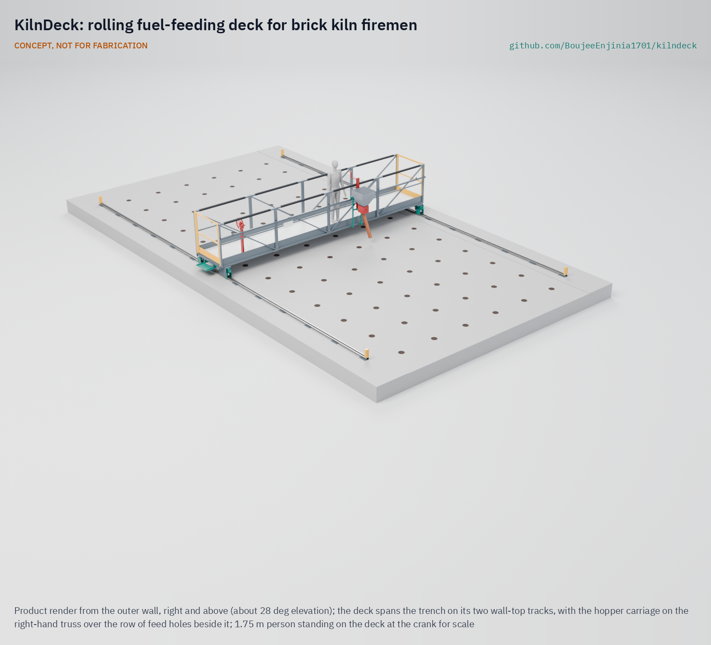

# KilnDeck

     

**Area:** Sustainable housing · **TRL:** 3 of 9 (proof of concept on paper) · **Value-engineering target:** USD 3,500 (estimated cost of the constructable design USD 2,627) · **Difficulty:** 4 of 5

Carries kiln firemen on a railed rolling deck so they feed fuel without standing on the ash crust over the fire.

> CONCEPT, NOT FOR FABRICATION. KilnDeck is a TRL 3 design on paper: it has not been built or tested.

## Concept rationale

The fireman's job is to feed small amounts of fuel into many holes, over and over. The hazard is where he stands to do it: on the crust above the fire. KilnDeck moves him off the crust. A deck with a guardrail spans the trench from wall to wall and rolls along the kiln on two tracks laid on the wall tops, so nothing rests on the crust. The fireman moves the deck from row to row with a hand wheel, pushes a hopper carriage along the side of the deck to each feed hole, and turns a crank to drop a measured dose through a swing spout. His feet stay on an insulated floor, behind a 1.1 m guardrail.

The metering rotor also serves the kiln. Research in Bangladesh found that training firemen in continuous fuel feeding was part of an intervention that cut fuel use and emissions ([Luby Lab, Stanford](https://lubylab.stanford.edu/brick-kiln-intervention-trial); [Stanford Impact Labs](https://impact.stanford.edu/news/cleaner-brick-manufacturing-bangladesh)). A rotor that gives the same small dose each pocket makes steady feeding easier. Keeping the deck manual and open means kiln owners can have it built by local fabricators without power at the kiln top.

## Burning platform

South Asia has about 51,450 fixed-chimney bull's trench kilns: about 35,000 in India, 11,500 in Pakistan, 4,500 in Bangladesh and 450 in Nepal. In each, two firemen standing on top of the kiln feed fuel through feed holes every 15 to 20 minutes, each round lasting 5 to 10 minutes ([Greentech Knowledge Solutions, 2014](https://www.shareweb.ch/site/Climate-Change-and-Environment/about%20us/about%20gpcc/Documents/01%20Fixed%20Chimney%20Bulls%20Trench%20Kiln%20(FCBTK).pdf)). Firemen interviewed in India described flames burning their trousers and their feet burning in the heat, with wooden slippers as their only protection ([The Migration Story](https://themigrationstory.com/post/braving-the-heat-to-bake-bricks/)).

The worst outcome is a fall into the fire. On 18 June 2026, a 30-year-old labourer named Shahbaz slipped into a burning kiln near Nankana Sahib, Pakistan, and died of his burns at the scene ([The Nation, 2026](https://www.nation.com.pk/18-Jun-2026/laborer-dies-falling-brick-kiln-nankana-sahib)). The workforce is large and poorly protected: brick kilns in India employ more than 23 million workers, many in debt bondage ([Anti-Slavery International](https://www.antislavery.org/what-we-do/past-projects/india-debt-bondage/)).

## Where it could be used

### By industry

| Industry | Use |
| --- | --- |
| Fired clay brick production | Safer fuel feeding on bull's trench and zigzag kilns |
| Kiln upgrade and clean brick programmes | A worker safety add-on that also supports steady, continuous feeding |
| Construction materials supply chains | A documented control buyers and developers can ask brick suppliers to adopt |
| Labour rights and worker health organisations | A practical safety measure to pair with rights work at kilns |
| Engineering and technical education | A field design case in high-temperature structures and hand mechanisms |

### By country or region

| Country or region | Why it matters there |
| --- | --- |
| India | About 35,000 bull's trench kilns ([Greentech, 2014](https://www.shareweb.ch/site/Climate-Change-and-Environment/about%20us/about%20gpcc/Documents/01%20Fixed%20Chimney%20Bulls%20Trench%20Kiln%20(FCBTK).pdf)) and more than 23 million kiln workers ([Anti-Slavery International](https://www.antislavery.org/what-we-do/past-projects/india-debt-bondage/)). |
| Pakistan | About 20,000 kilns of all types employing around 4.5 million workers ([Al Jazeera, 2019](https://www.aljazeera.com/features/2019/10/21/the-spiralling-debt-trapping-pakistans-brick-kiln-workers)), and a fatal fall into a burning kiln in June 2026 ([The Nation](https://www.nation.com.pk/18-Jun-2026/laborer-dies-falling-brick-kiln-nankana-sahib)). |
| Bangladesh | About 4,500 bull's trench kilns ([Greentech, 2014](https://www.shareweb.ch/site/Climate-Change-and-Environment/about%20us/about%20gpcc/Documents/01%20Fixed%20Chimney%20Bulls%20Trench%20Kiln%20(FCBTK).pdf)); the brick sector may cause up to half of the particulate matter in Dhaka, and kilns are the site of active clean-kiln research ([Stanford Impact Labs](https://impact.stanford.edu/news/cleaner-brick-manufacturing-bangladesh)). |
| Nepal | A national survey counted 176,373 manual labourers in brick kilns, of whom 6,229 were in forced labour ([Kathmandu Post, 2021](https://kathmandupost.com/national/2021/01/29/forced-labour-bonded-labour-and-child-labour-prevalent-in-country-s-brick-kilns-sector-new-report-says)). |

## What sparked the idea

The idea came from a short news report. On 18 June 2026, Shahbaz, 30, was working at a brick kiln near Jislani Mor on Warburton Road, Nankana Sahib, when he slipped into the burning kiln; rescue officials said he died at the scene ([The Nation, 2026](https://www.nation.com.pk/18-Jun-2026/laborer-dies-falling-brick-kiln-nankana-sahib)). The report does not say what task he was doing. But on every bull's trench kiln the firemen work standing on the kiln top over the fire ([Greentech, 2014](https://www.shareweb.ch/site/Climate-Change-and-Environment/about%20us/about%20gpcc/Documents/01%20Fixed%20Chimney%20Bulls%20Trench%20Kiln%20(FCBTK).pdf)), and a deck with a guardrail is a direct answer to that exposure.

## Problem

Firemen on bull's trench brick kilns stand and walk on the hot ash crust over the fire to feed fuel through holes in the kiln top, for hours at a time. A slip or a weak spot in the crust can drop them into the burning kiln.

Full problem statement: [docs/01-problem.md](docs/01-problem.md)

## Concept

A walkway deck that spans the trench and rolls along the kiln on two wall-top tracks, carrying the fireman behind a guardrail and a hopper carriage with a hand metering rotor; the fireman moves the deck from row to row with a hand wheel and meters fuel into each feed hole without standing on the ash crust over the fire.

Full design precis: [docs/02-concept.md](docs/02-concept.md) · Requirements: [docs/03-requirements.md](docs/03-requirements.md) · Calculations: [docs/04-calcs/01-sizing.md](docs/04-calcs/01-sizing.md) · Prototype build plan: [docs/05-build-plan.md](docs/05-build-plan.md) · Design decisions: [docs/06-design-decisions.md](docs/06-design-decisions.md)

## Key components

- Wall-top track modules on levelling pads, with end stops
- End trucks with guiding and floating wheels and derailment guards
- Side trusses that are also the 1.1 m guardrails
- Insulated floor panels with a reflective underside
- End rail and inward-opening self-closing gate
- Hand wheel, line shaft and chain drives, with a lock pin as the parking brake
- Hopper carriage with a 52 L hopper, metering rotor, crank and swing spout

## Key numbers (estimates, KND-CAL-001)

- Deck about 800 kg; no piece over 40 kg, so two people carry every part up the kiln.
- Hand wheel force about 64 N to move the loaded deck on level track.
- About 0.49 kg of coal per rotor pocket; the hopper holds about 1.4 feeding rounds.
- Floor top about 48 °C in shade against a crust of about 150 °C; about 74 °C in full summer sun (requirement R7 not met in full sun).

## Building the prototype

The [prototype build plan](docs/05-build-plan.md) (KND-BLD-001) shows how to make each of the 22 groups of parts, with a making sketch, joint close-ups and a picture for every one of the 17 assembly steps. Almost everything is cut, drilled and stick welded from stock steel hollow section, channel and plate; wheels, bearings, chains, the hand wheel and the insulation board are bought. The deck is assembled on trestles over the cold zone of the kiln and rolled to the fire only when complete. It is a plan, not yet built: building and testing to it is TRL 4 work.

## Safety

> **Safety:** KilnDeck carries a person over a burning kiln and has moving parts. It is published as an open engineering reference, not certified equipment. Kiln owners and builders are responsible for their own structural checks and risk assessment.
>
> The tracks must bear on sound kiln walls; a structural survey of each kiln is needed before fitting.
>
> The guardrail is a fall-prevention barrier and must be proof-loaded before use. The gate opens only inward and closes by itself.
>
> End stops and derailment guards keep the deck on its track; the lock pin must be in before feeding at each row.
>
> The chain drives and rotor are guarded; clear the rotor only with the crank, never by hand.
>
> Heat exposure to the fireman remains: the floor reaches about 74 °C in full sun, so heat-resistant footwear, shade, water and rest breaks are still needed. Hot steel surfaces have heat-resistant grip sleeves on the top rails.
>
> Assemble the deck only over the cold zone of the kiln, never over the fire.

## Repository layout

| Folder | Contents |
| --- | --- |
| `docs/` | Problem, concept, requirements, calculations, build plan and design decisions |
| `cad/src/` | build123d Python source, the source of truth for all geometry |
| `cad/step/`, `cad/stl/` | Exported models for FreeCAD, other CAD tools and printing |
| `cad/drawings/` | General arrangement and making sketches |
| `bom/` | Bill of materials |
| `electronics/` | Not used: KilnDeck has no electronics |
| `firmware/` | Not used |
| `media/` | Renders, concept media and the 3D viewer |
| `build-log/` | Dated prototyping notes (from TRL 4) |

## Documentation

Controlled documents follow the portfolio [documentation standard](.kit/STANDARDS.md). Each carries a document ID (KND-PRC-001 for the precis), a version and a revision history. Branded PDFs are built with `python .kit/render.py` and attached to GitHub Releases when a document is tagged, for example `KND-PRC-001/v1.0`.

## Credits

Designed by Amish Chadha at Design Molecule Labs. See [CONTRIBUTORS.md](CONTRIBUTORS.md) for roles. To cite this design, use [CITATION.cff](CITATION.cff) (GitHub shows it as "Cite this repository").

AI assistance (Claude) was used to accelerate prototype documentation and first-pass research. Design direction and all decisions are Amish Chadha's, recorded in this repository's decision records (`docs/decisions/`).

## Licenses

- **Hardware** (CAD, drawings, BOM, electronics): [CERN-OHL-S v2](LICENSE)
- **Software** (firmware, scripts, notebooks): [MIT](LICENSE-SOFTWARE)

A project of the [Design Molecule](https://designmolecule.com) lab.
