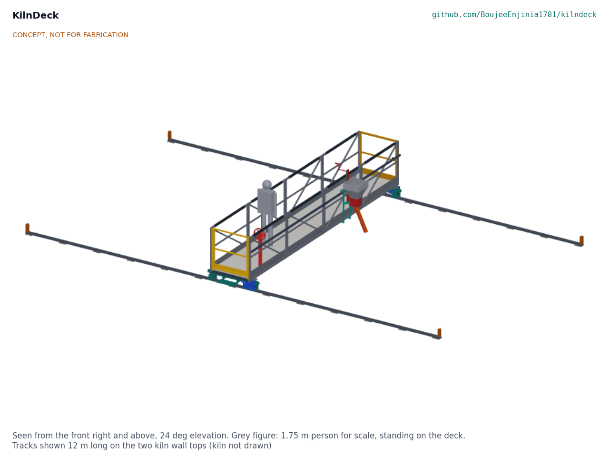

# KilnDeck design precis

Carries kiln firemen on a railed rolling deck so they feed fuel without standing on the ash crust over the fire.

*Figure 1. The deck spanning the trench on its two wall-top tracks, with the hopper carriage on the right-hand truss and a 1.75 m person on the deck for scale (concept media from the TRL 3 model).*

## How it works

The deck is a walkway bridge that spans the trench from the outer wall to the inner wall and rolls along the kiln on two tracks, one laid on each wall top. Nothing rests on the crust. The fireman boards from the outer wall through a self-closing gate and works inside a 1.1 m guardrail on an insulated floor about 0.4 m above the wall top. He moves the whole deck along the kiln with a hand wheel at the outer end, which drives one wheel at each end through a line shaft so both ends move together; a lock pin in the hand wheel rim holds the deck at each row of feed holes. A hopper of about 52 litres rides on a carriage along the outside of the right-hand truss, over the row of holes beside the deck. He pushes the carriage to a hole, swings the spout over it, and turns a crank above the guardrail: each quarter turn of the metering rotor drops one pocket of fuel, about 0.49 kg of coal (estimate). When the row is fed he rolls the deck about 1 m to the next row. He refills the hopper at the outer end from fuel stocked on the wall top.

## Components

*Table 1. Components (numbers match bom/bom.csv and the exploded view).*

| # | Component | Role |
| --- | --- | --- |
| 1 | Levelling pads | Spread the track load on the wall tops, one every 1.0 m |
| 2 | Track modules | 3 m lengths of channel with a round bar rail, joined by sliding fishplates |
| 3 | Track end stops | Stop the deck at the ends of each track run |
| 4 | End trucks | Carry the deck ends on the tracks, with derailment guards and buffers |
| 5 | Track wheels | U-groove wheels: the outer pair guides, the inner pair floats |
| 6 | Side trusses | Span the trench; their top chords are the top rails of the guardrail |
| 7 | Cross bearers | Carry the floor and make the trusses and floor into stiff U-frames |
| 8 | Insulated floor panels | Standing surface that keeps crust heat off the feet |
| 9 | End rail and gate | Close both ends; the gate opens only inward |
| 10 | Travel drive | Hand wheel, line shaft and chain drives; the lock pin is the parking brake |
| 11 | Carriage rail | Runs along the outside of the right-hand truss |
| 12 | Hopper carriage | Carries the hopper along the deck |
| 13 | Fuel hopper | About 52 L, with a grille that keeps hands from the rotor |
| 14 | Metering rotor and crank | Drops a set dose of fuel per pocket |
| 15 | Swing spout | Directs fuel into the feed hole beside the deck |
| 16 | Grip sleeves | Heat-resistant sleeves on the top rails |

## Key design choices

All decided by Amish under his pre-approval of 2026-10-03 (KND-DDR-001 and KND-DDR-002).

1. **The deck spans the trench and bears only on the walls.** It reaches every hole by moving along the kiln, so no support ever stands on the crust.
2. **Movable track on the straight sides.** 3 m modules, about 33 kg each, are laid ahead of the fire and lifted behind it. The curved ends are not served by this prototype.
3. **The guardrail is the structure.** Two trusses 1.14 m deep carry the floor across 6.6 m, and their top chords are the top rails.
4. **Both ends driven together.** A hand wheel and line shaft stop the long deck skewing on its short wheelbase.
5. **Fuel beside the deck, not under it.** The hopper carriage feeds the next row of holes, so the floor has no openings over the fire and the fireman's feet stay at least 0.6 m from an open hole.
6. **Coal or biomass.** One rotor; the dose is set by the number of pockets.
7. **No piece over 40 kg.** Every module is carried up by two people and bolted together on the kiln, over the cold zone.

## First-order numbers

From KND-CAL-001 (`docs/04-calcs/sizing.py`). All are estimates for a design that has not been built.

*Table 2. First-order numbers.*

| Quantity | Value | Assumption |
| --- | --- | --- |
| Coal per fireman per round | about 30 kg | 30,000 bricks a day, 1.2 MJ per kg of brick, 22 MJ/kg coal, a round every 17.5 min, two firemen |
| Hopper | 52 L, about 42 kg of coal or 13 kg of biomass; 1.4 rounds per fill | Bulk density 0.80 and 0.25 kg/L |
| Dose | about 0.49 kg of coal per pocket, 1.97 kg per turn | 80 % pocket fill |
| Deck mass | about 800 kg; heaviest piece 39 kg | From the model solids |
| Bridge | 11 MPa in the chords, 0.5 mm deflection | 250 kg rated load at mid-span, 1.25 dynamic factor |
| Guardrail | 91 to 100 MPa under a 1 kN push; 150 MPa at the 1.5 kN proof load | S275 steel, yield 275 MPa |
| Hand wheel force | 64 N on level track | Rolling resistance 2 % |
| Wall bearing | 0.15 MPa under a pad | Interim limit 0.20 MPa until the survey |
| Floor top temperature | 34 °C at night, 48 °C in shade, 74 °C in full sun at 45 °C air | Crust 150 °C; the bare crust is the comparison |
| Parts cost | USD 2,627 | Value-engineering target: USD 3,500. Estimated cost of the constructable design: USD 2,627 (USD 873 under the target) |

## Patent design-arounds

From the preliminary patent, trademark and prior-art screen (not legal advice):

- Manual metering rotor only; no motorised feeder.
- Watch any Stanford or BUET patent filing on kiln coal feeders.
- The rotating-disc charger of US1506924A (1924) has expired and is free prior art; KilnDeck uses a pocketed rotor on a horizontal shaft, not a disc.
- Watch items from the preliminary screen: rail heat and wall-top load. Both are now handled in the design (sliding track joints, floating inner wheels, pads under an interim bearing limit).

## Shared blocks

- CalRig proof-load for the guardrail, deck and wall-top tracks at TRL 4.

## Safety

> **Safety:** KilnDeck carries a person over a burning kiln and has moving machinery. The hazards and their controls in this design are: a fall from the deck (1.1 m top rail, knee rail and toe board on all four sides; an inward-opening self-closing gate); the deck running off its track (end stops on every track end, buffers on the trucks, derailment guards either side of each track); the deck moving while someone boards or feeds (lock pin in the hand wheel; the gate is at the hand wheel end); crushed fingers in the drive and rotor (sealed chain case, sheet chain guards, a grille over the hopper, a crank turned by hand with low force); hot surfaces (silicone grip sleeves; an insulated floor, which still reaches about 74 °C in full summer sun, so heat-resistant footwear stays necessary); and the kiln wall giving way (pads under an interim bearing limit and a structural survey of each kiln before fitting).
>
> The deck is assembled over the cold zone of the kiln and rolled to the fire only when complete. Heat exposure to the fireman remains: shade, water and rest breaks are still needed. The guardrail and deck must be proof-loaded before use (TRL 4). This design is published as an open engineering reference. It is not certified equipment.

## Open questions

None for the design; all decisions are recorded in the design decisions register (KND-DEC-001). Facts that depend on the partner kiln (trench width, wall condition, feed hole grid, crust temperature) and on the parts bought are listed there to confirm.
